# 实验一： OpenWrt 虚拟机搭建

### 实验目的

- 熟悉基于 `OpenWrt` 的无线接入点（AP）配置。
- 为第二章、第三章和第四章实验准备好「无线软 AP」环境。

### 实验要求

+ [x] 对照 [第一章 实验](https://c4pr1c3.github.io/cuc-mis/chap0x01/exp.html) `无线路由器/无线接入点（AP）配置` 列的功能清单，找到在 OpenWrt 中的配置界面并截图证明；

+ [x] 记录环境搭建步骤；

+ [x] 如果 USB 无线网卡能在 `OpenWrt` 中正常工作，则截图证明；

+ [x] 如果 USB 无线网卡不能在 `OpenWrt` 中正常工作，截图并分析可能的故障原因并给出可能的解决方法。

### 实验环境

* 物理机系统: `Win10`

* 虚拟机软件：`VirtualBox` 

* 虚拟机系统：`openwrt`

* 可以开启监听模式、AP 模式和数据帧注入功能的 USB 无线网卡,本实验为`Netgear WNDA3100v3`

  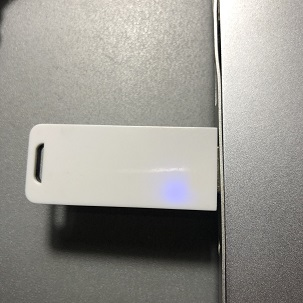

### 实验过程

**step1:手动搭建openwrt虚拟机环境**

* 下载[openwrt img](https://downloads.openwrt.org/snapshots/targets/x86/64/openwrt-x86-64-generic-ext4-combined.img.gz)镜像并解压；

* 将`VBoxManage`加入环境变量；

* 切换到相关路径，在git bash中执行：

  `dd if=openwrt-19.07.5-x86-64-combined-squashfs.img of=openwrt.img bs=128000 conv=sync`

  `VBoxManage convertfromraw --format VDI openwrt.img openwrt-x86-64-combined-squashfs.vdi`

  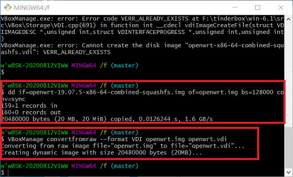

* 在VirtualBox 中选择新生成的vdi文件创建虚拟机；

* 虚拟设置按实验要求配置为双网卡，删除IDE控制器。

  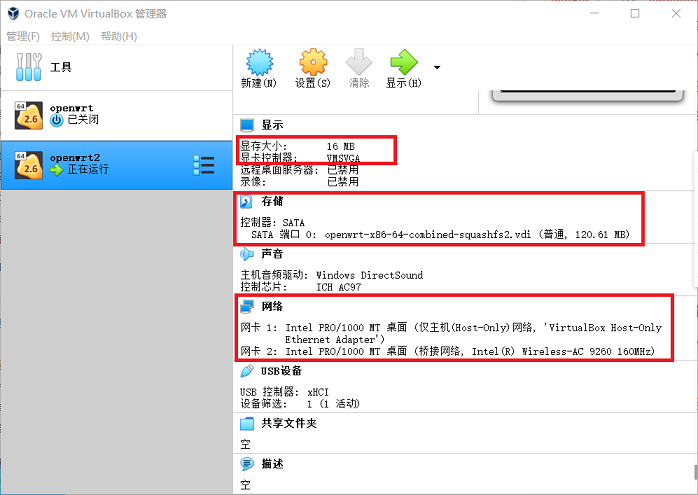

* 开启虚拟机成功！！！

  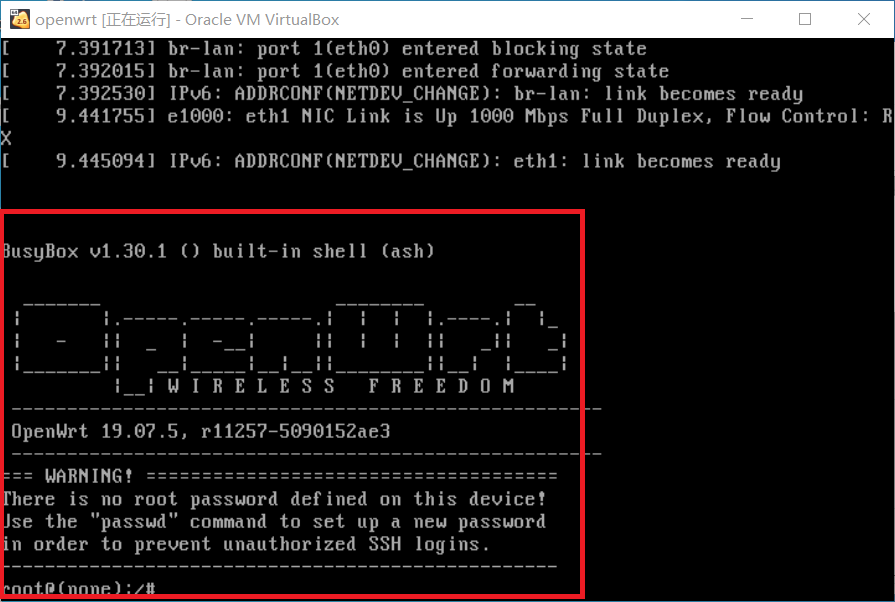

**step2  实现通过浏览器访问openwrt管理界面 **

* 启动虚拟机，修改`/etc/config/network`中的IP地址；

  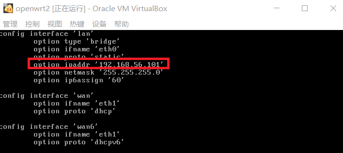

* 执行`ifdown eth0 && ifup eth0`重新加载网卡使配置生效；

* 通过`opkg`下载并安装`luci`,x相关命令如下：

  `opkg update`	 # 	更新 opkg 本地缓存

  `opkg find luci`	# 	检索指定软件包

  `opkg depends luci`	#	 查看 luci 依赖的软件包有哪些 

  `opkg list-installed`	 #	 查看系统中已安装软件包

  `opkg install luci`	 # 	安装 luci

  `opkg files luci-mod-admin-full`	# 	查看 luci-mod-admin-full 在系统上释放的文件有哪些

* 登录管理页面成功！！！

  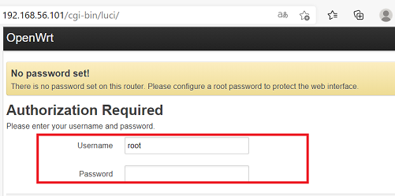

**step3 开启AP功能**

* 执行`opkg update && opkg install usbutils`安装查看USB无线网卡相关的件包；

* 执行`lsusb` `lsusb -t`查看USB外设信息以及驱动加载情况；

  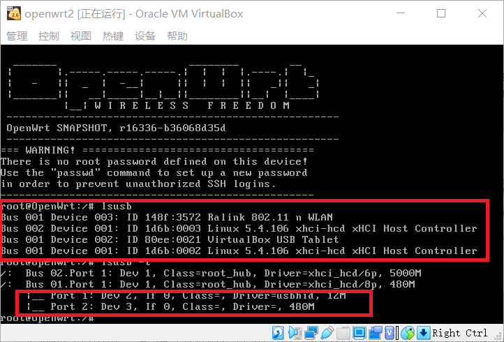

  由反馈信息可知，驱动未完全加载，故要手动加载一下~

* 通过`opkg find`或者科学搜索（本人）快速查找可能包含指定芯片名称的驱动程序包。

  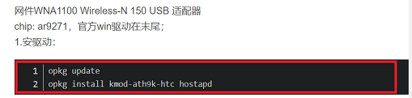

  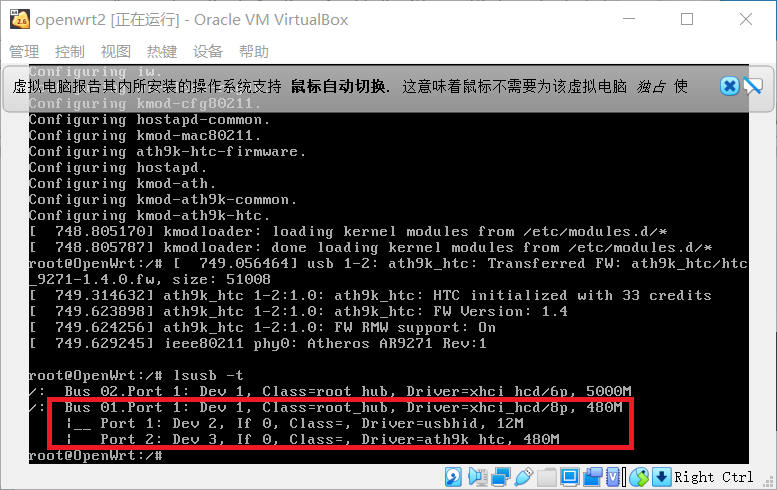

* 登陆到管理页面，发现wireless选项，根据实验要求：

  `Interface Configuration` 表单里 `Network` 勾选 `wan`

  虚拟网络类型必须设置为 `NAT`

  手工设置信道和信号强度

* 点击 `Enable` 按钮启用网络

* 重启！！！

  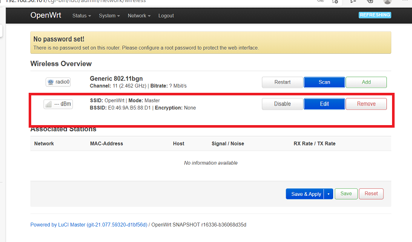

### 实验结果

- 重置和恢复AP到出厂默认设置状态 & 设置AP的管理员用户名和密码

  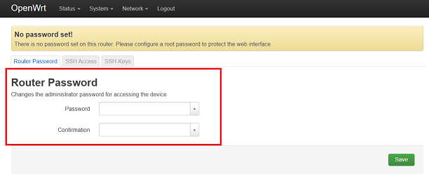

- 设置SSID广播和非广播模式 & 查看AP/无线路由器支持哪些工作模式

  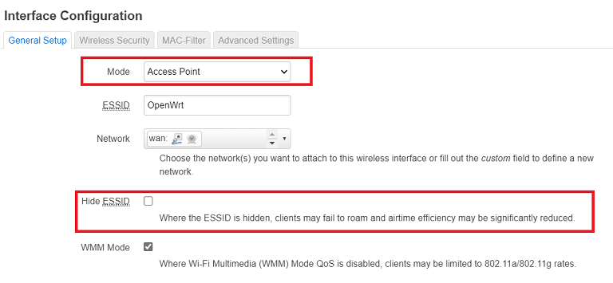

- 配置不同的加密方式 & 配置AP隔离(WLAN划分)功能 &设置MAC地址过滤规则（ACL地址过滤器）

  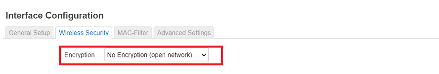

  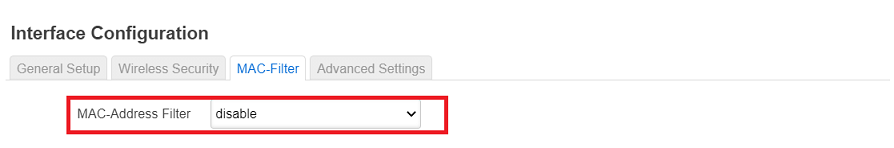

  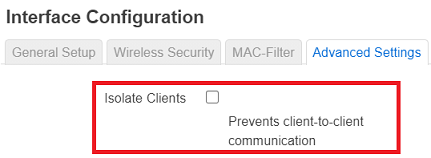

- 配置无线路由器使用自定义的DNS解析服务器/配置DHCP和禁用DHCP/开启路由器/AP的日志记录功能（对指定事件记录）

  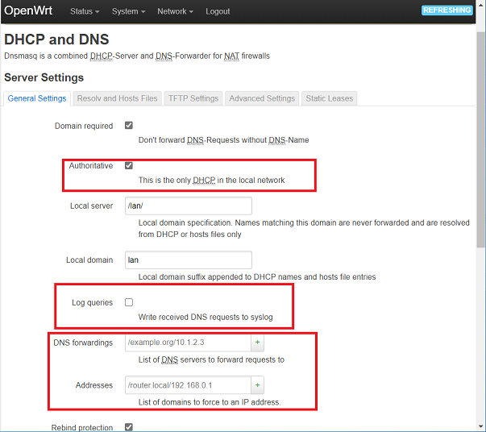

  

* 在没有客户端加入当前无线网络时，我们在 `LuCi` 上查看无线网络状态如下图所示：

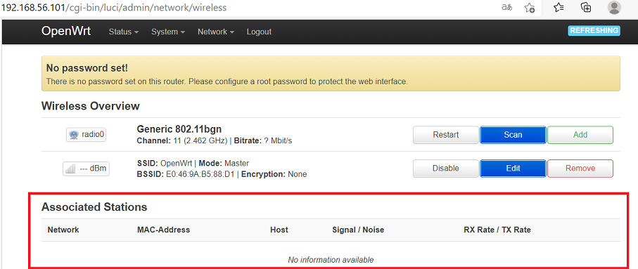

* 当有客户端加入当前无线网络时，我们在 `LuCi` 上查看无线网络状态如下图所示 :

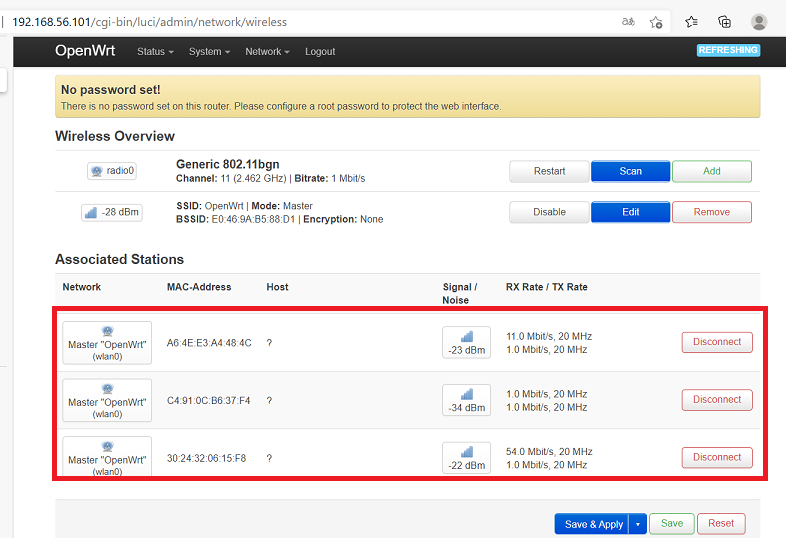

* 断开后重连，终端的提示信息如下图所示：

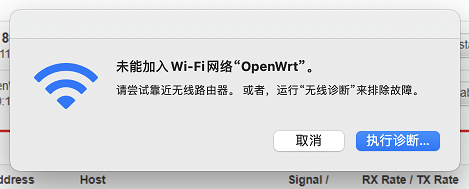

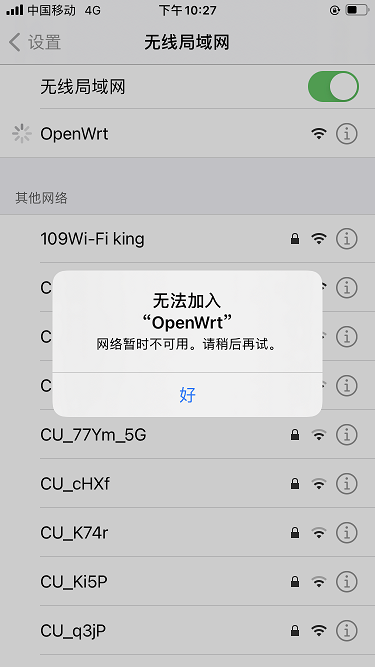

### 实验问题及反馈

###### 1.下载`openwrt-19.07.5-x86-64-combined-squashfs.img`在安装`usbutils`包时报错：`/overlay  存储区内存不足` 而不能安装？

搜了一些解决方案，多数为`U盘扩容`。手里没有U盘，于是转念一想，其它版本会不会系统文件较少，足够安装`usbutils`,试了`openwrt-x86-64-generic-ext4-combined.img`版本，曲线救国啦！

###### 2.openwrt无法识别USB网卡信息？

教学视频有讲，要装`virtual box-extpack`!

###### 3.在step2中多次出现无法连接外网，step4中开不了无线网等状况？

重启真的有用，`reboot`一次性解决！

### 实验参考

[实验一](https://c4pr1c3.github.io/cuc-mis/chap0x01/exp.html)

[WNA1100驱动](http://www.voidcn.com/article/p-hoouvilo-zp.html)