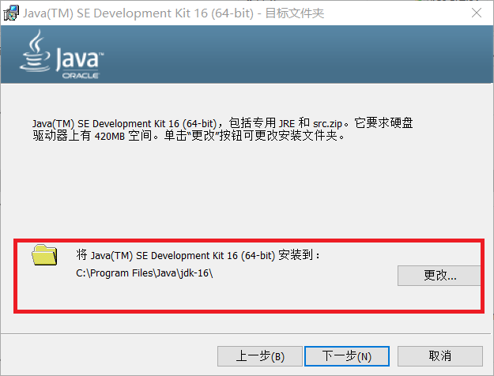
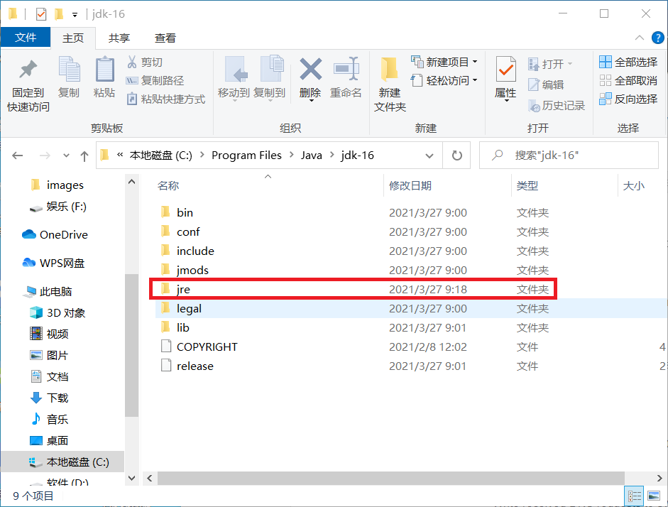
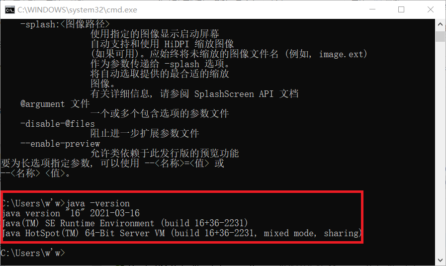
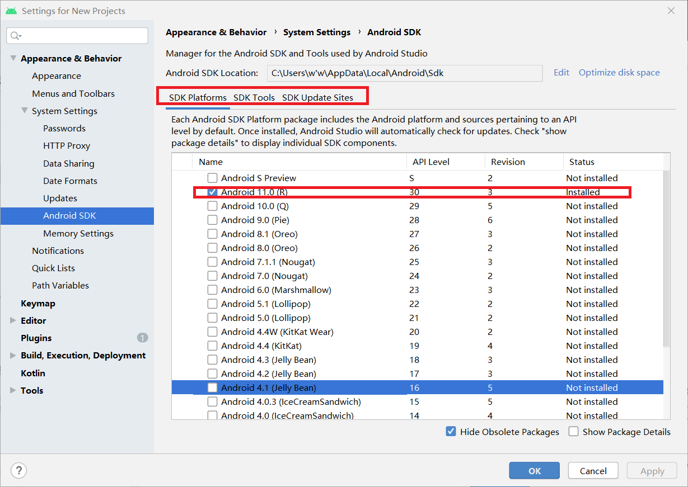
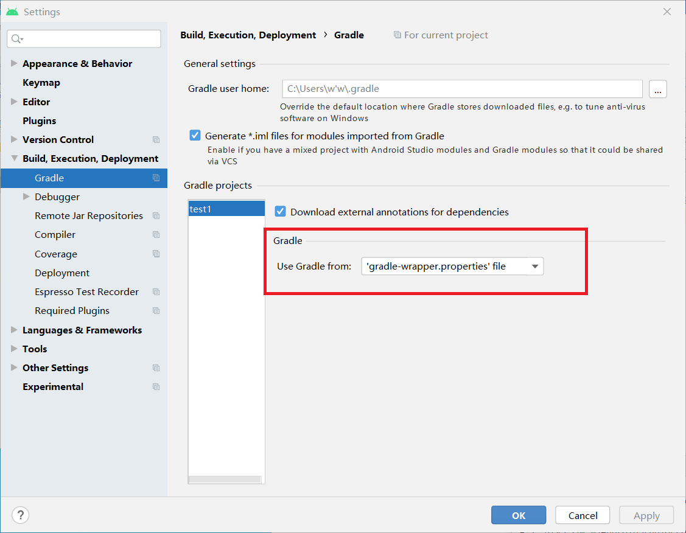
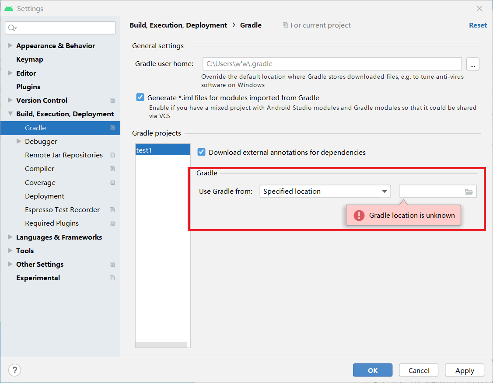
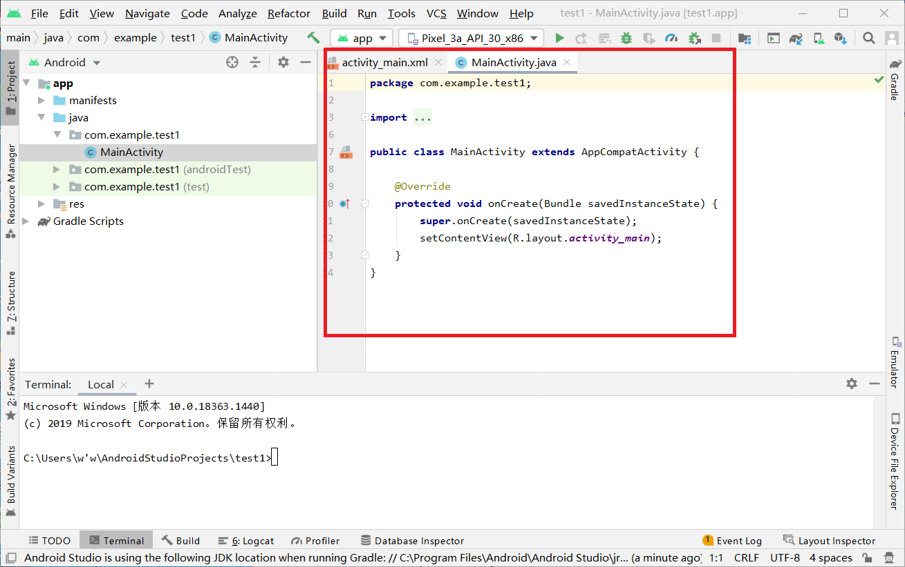
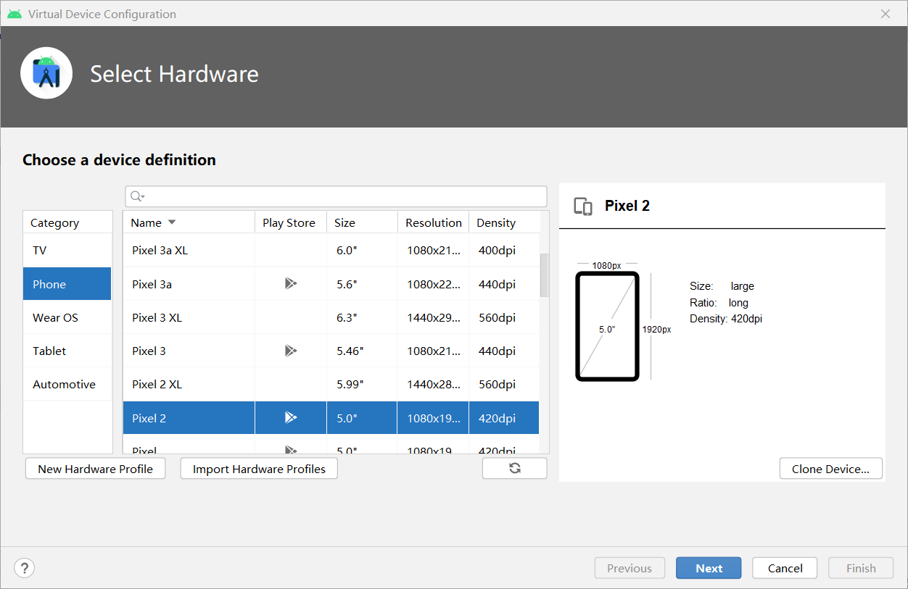
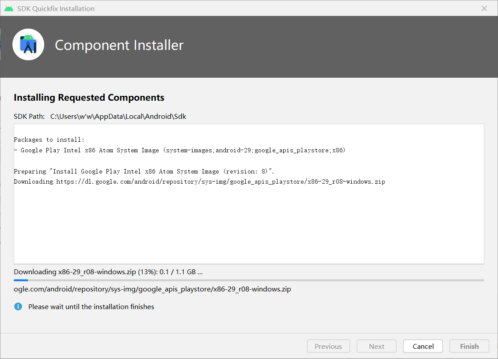
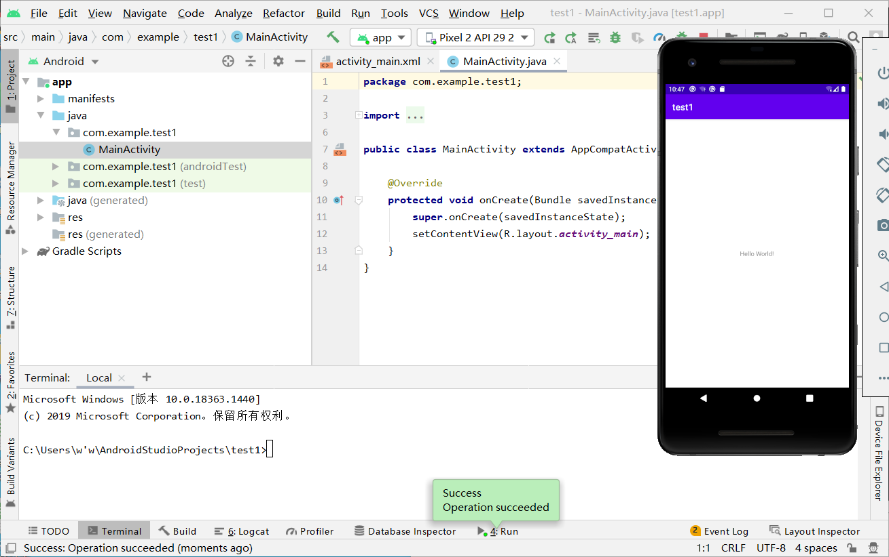

# 实验五： Android stdio环境搭建

### 实验要求

+ [x] 安装和配置`Java SDK`;

+ [x] 安装`Android Studio`

+ [x] 下载安装 `Android SDK`

+ [x] 配置 `Android`模拟器运行环境
+ [x] 配置 `Gradle` 编译环境

### 实验环境

* 物理机系统: `Win10`
* [Java SDK](https://download.oracle.com/otn-pub/java/jdk/16+36/7863447f0ab643c585b9bdebf67c69db/jdk-16_windows-x64_bin.exe?AuthParam=1616806260_d1cb0d30d8491b69d223fbe1058331b3)
* [Android stdio](https://r3---sn-4g5e6ns6.gvt1.com/edgedl/android/studio/install/4.1.3.0/android-studio-ide-201.7199119-windows.exe?cms_redirect=yes&mh=es&mip=62.216.92.21&mm=28&mn=sn-4g5e6ns6&ms=nvh&mt=1616806597&mv=u&mvi=3&pl=25&shardbypass=yes)

### 实验过程

**step1:安装和配置 Java SDK**

* 下载所需`Java SDK`;

  

* 切换到Java的安装目录下，执行`bin\jlink.exe --module-path jmods --add-modules java.desktop --output jre` 生成`jre`文件；

  

* 将Java加入到环境变量中。

  

**step2 安装Android Studio**

* 下载并安装Android Studio；

* 安装后打开Android Studio，设置并选择Android SDK,以及进行一系列配置。

  

**step3 配置Gradle**

* 创建项目后，打开`File->settings`,搜索`Gradle`进行配置，可选内置 `Gradle` 或自己安装的 `Gradle`。

  * 选择内置`Gradle`

  * 选择手动下载的`Gradle`

  

### 实验结果

* 创捷了一个`Empty Activity`项目，运行如下：

### 实验参考

[实验五说明文档](https://c4pr1c3.github.io/cuc-mis/chap0x05/exp.html)

[Java安装教程](https://blog.csdn.net/qq_41873673/article/details/108027074)

[Android 入门教程](https://blog.csdn.net/weixin_43883917/article/details/108950310?utm_medium=distribute.pc_relevant.none-task-blog-baidujs_baidulandingword-9&spm=1001.2101.3001.4242)

[Gradle配置教程](https://blog.csdn.net/xxf377376701/article/details/78114434?utm_medium=distribute.pc_relevant.none-task-blog-2~default~BlogCommendFromMachineLearnPai2~default-1.control&dist_request_id=&depth_1-utm_source=distribute.pc_relevant.none-task-blog-2~default~BlogCommendFromMachineLearnPai2~default-1.control)

