# Android 缺陷应用漏洞攻击实验

### 🌟实验目的

- 理解 Android 经典的组件安全和数据安全相关代码缺陷原理和漏洞利用方法

- 掌握 Android 模拟器运行环境搭建和 ADB 使用

  

### 🌟实验环境

* 主机 macOS Big Sur
* Android Studio 4.2.1
* Python 2.7.16


### 🌟实验要求

* 详细记录实验环境搭建过程

- 至少完成以下实验
  * [x] Developer Backdoor
  * [x]  Insecure Logging
  * [x] Android Application patching + Weak Auth
  * [x]  Exploiting Android Broadcast Receivers
  * [x] Exploiting Android Content Provider
  * [ ] （可选）使用不同于 [Walkthroughs](https://github.com/c4pr1c3/Android-InsecureBankv2/tree/master/Walkthroughs) 中提供的工具或方法达到相同的漏洞利用攻击效果推荐 [drozer](https://github.com/mwrlabs/drozer)


### 🌟实验过程

#### step 1. 搭建InsecureBankv2环境

* 克隆GitHub库[c4pr1c3 - GitHub - Android-InsecureBankv2](https://github.com/c4pr1c3/Android-InsecureBankv2)到本地

* 切换到`InsecureBankv2`目录下安装所需要的包，终端执行：`pip2 install -r requirements.txt`

* 运行.py文件：`python app.py`

  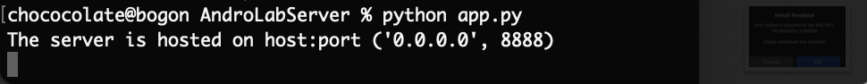

* 打开`Android Studio`，运行一个emulator模拟器

* 另启终端，切换到`/Users/chococolate/Library/Android/sdk/platform-tools`,执行：

  ```
  adb devices  
  adb -s emulator-5554 install /Users/chococolate/Desktop/Android-InsecureBankv2/InsecureBankv2.apk
  ```

  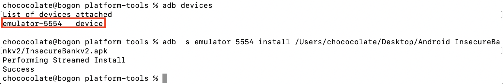

* 打开Android Studio模拟器，发现`InsecureBankv2`安装成功：

  


* 用`jack/Jack@123$`登陆，看是否可以正常通信：

  

  

* 本地记录如下：

  


#### step 2. Developer Backdoor

* 下载[dex2jar](https://github.com/skylot/jadx/releases/download/v1.2.0/jadx-1.2.0.zip)和[jadx](https://github.com/skylot/jadx/releases/tag/v1.2.0)

* 解压`InsecureBankv2.apk`文件，并将解压出来的`calsses.dex`移至`dex2jar`文件夹下：`cp classes.dex dex2jar`

* 切到`dex2jar`目录执行:

  ```
  chmod +x d2j-dex2jar.sh
  chmod +x d2j_invoke.sh
  sh d2j-dex2jar.sh classes.dex --force
  dex2jar classes.dex -> ./classes-dex2jar.jar
  ```

* 切换到`jadx/bin`,双击`jadx-gui`,选择打开`classes-dex2jar.jar`

  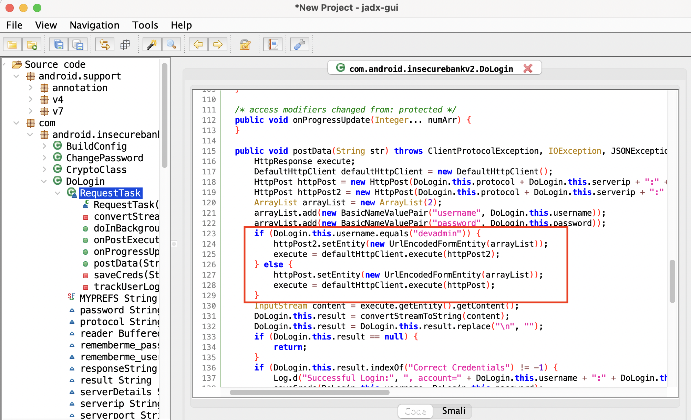

* 由反编译代码可知，与所有其他用户相比，该后门为用户名为`devadmin`的用户设置了不同的端点。

  利用该漏洞，使用`devadmin`账号登陆效果如下：


#### step 3. Developer Backdoor

* 切换至`/Users/chococolate/Library/Android/sdk/platform-tools`,执行`./adb logcat`

  发现日志会记录用户登陆、密码等信息：

  

* 同时发现当用户改密码时，日志中会有相关的信息记录并且密码会在短信中明文提醒：

  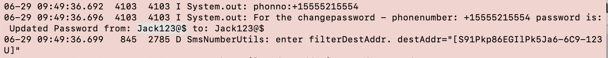

* 在`InsecureBankv2`登陆并进行密码修改，相应的发现会密码会被短信明文输出：


#### step 4. Android Application patching + Weak Auth

* 下载[apktool](http://ibotpeaches.github.io/Apktool/.)
* 切换到`InsecureBankv2.apk`所在目录，执行`apktool d InsecureBankv2.apk`，会新生成`InsecureBankv2`文件夹
* 切至`InsecureBankv2/res/values`，编辑`strings.xml`，将`is_admin`的值由`no`改为`yes`

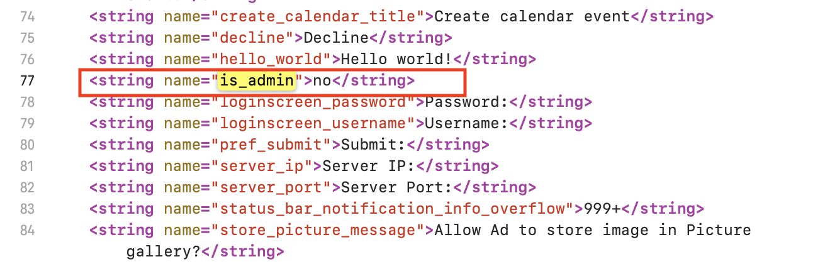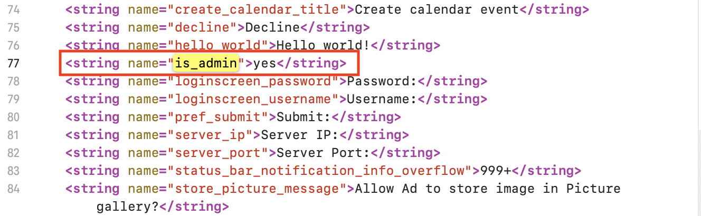

* 执行`apktool b InsecureBankv2`，在`InsecureBankv2/dist`下可发现新生成的 `InsecureBankv2.apk`，为便于区别将其重命名为 `InsecureBankv2.s.apk`

* 直接执行adb install InsecureBankv2.s.apk，有以下报错：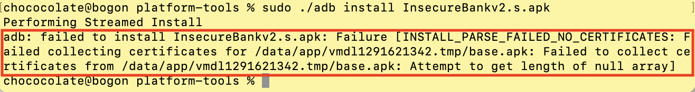

* 因此，需要对`InsecureBankv2.s.apk`进行签名。新建sign文件夹，将`InsecureBankv2.s.apk`移入，并执行：

  ```  
  keytool -genkey -v -keystore android.keystore -alias androidKeystore -keyalg RSA -keysize 2048 -validity 10000 
  jarsigner -verbose -sigalg SHA1withRSA -digestalg SHA1 -keystore android.keystore InsecureBankv2.s.apk androidKeystore
  jarsigner -verify -verbose -certs InsecureBankv2.s.apk
  ```

* 再次执行`adb install InsecureBankv2.s.apk`,登陆后发现屏幕显示为用户提供了一个额外的“创建用户”按钮，且此按钮以前不可见，仅适用于管理员用户：

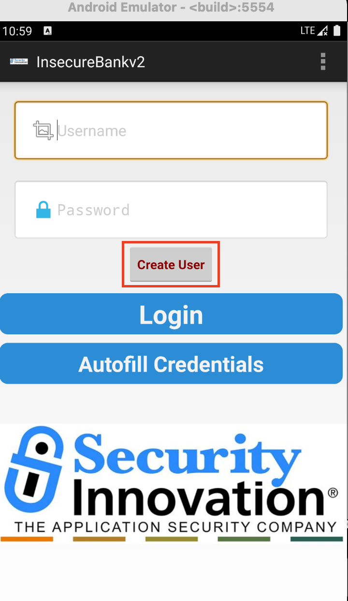

#### step 5. Exploiting Android Broadcast Receivers

* `classes-dex2jar.jar`中查看 `Broadcast Receivers` 传递的参数:

  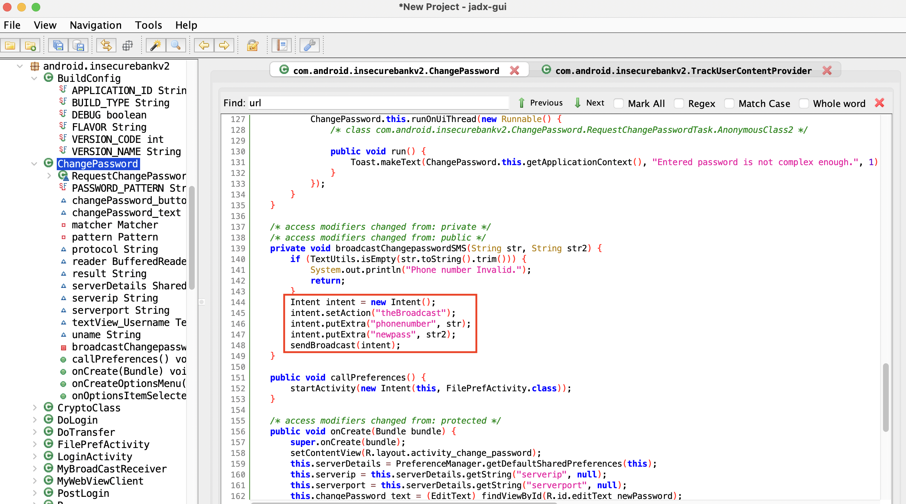

  

* 在模拟器登陆账号后，然后在本地终端执行：

  ```
  adb shell 
  am broadcast -a theBroadcast -n com.android.insecurebankv2/com.android.insecurebankv2.MyBroadCastReceiver --es phonenumber 5554 –es newpass Dinesh@123!
  ```

* 回到应用，收到密码更新短息通知：

  在模拟器上会收到更新密码的提示：

  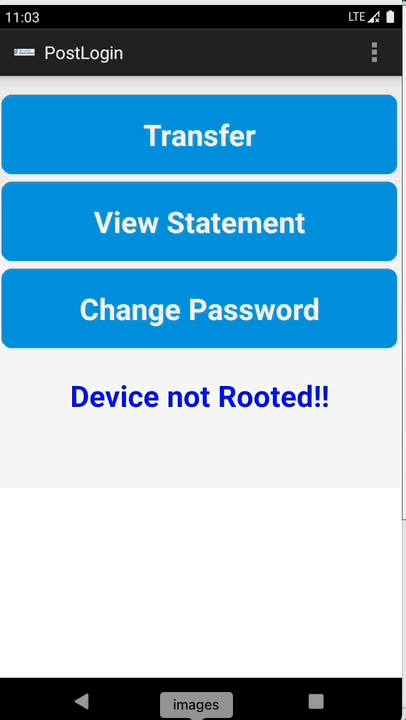


#### step 6. Exploiting Android Content Provider    

* `classes-dex2jar.jar`中查看`TrackUserContentProvider`参数：

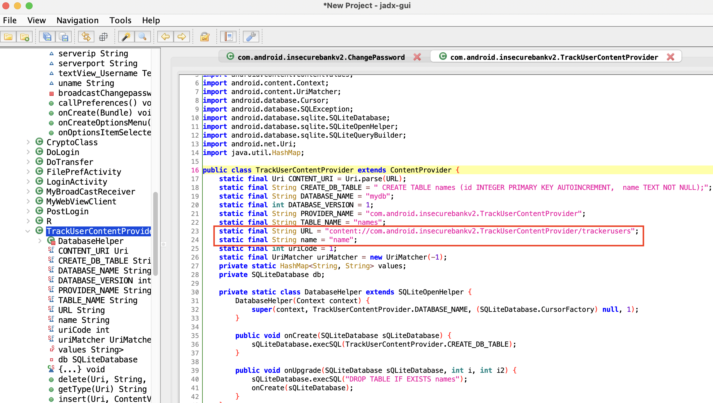

* 在模拟器上进行多用户登陆后，在本地终端输入`content query --uri content://com.android.insecurebankv2.TrackUserContentProvider/trackerusers`,可以看到所有用户的登录历史：

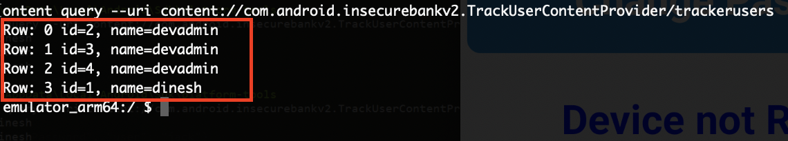


### 🌟实验过程中遇到的问题

##### 1.在step2中执行`sh d2j-dex2jar.sh classes.dex时遇到Operation not permitted`错误?


解决：执行 `xattr -d -r com.apple.quarantine ./*`

所查资料显示：rwxrwxrwx@ 文件的属性最后带个@，这个@代表的是更多的一些属性，具体含义不太清楚，但有它就是执行不了，所以需要用这个命令来去除这个属性。

##### 2.在step4中新生成的.apk文件签字后仍报错：`signatures do not match previously installed version`?

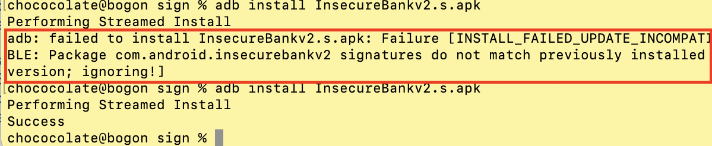

解决：`在emulator里手动删除原来版本的app`

搜了相关，还是不太清楚为什么会报错🥱 或许换别的签字方法能行得通？直接删除这个方法釜底抽薪，不够elegant😓


### 🌟实验反思

安装python、brew之类一大堆错误不提也罢，但是不懂为什么用Jadx十次会有九次崩溃，靠一些运气完成实验...

想过用其他工具，有推荐使用be like Win上Android Killer的[Android Crack Tool](https://github.com/Jermic/Android-Crack-Tool),但是按照教程安装会报错T^T


### 🌟参考文档

[Walkthroughs](https://github.com/c4pr1c3/Android-InsecureBankv2/tree/master/Walkthroughs)

[mac装jadx](https://www.jianshu.com/p/3cc4e861b3db)

[mac装apktool](https://www.jianshu.com/p/e5deb664b769)

[jarsigner](https://www.cnblogs.com/huangenai/p/9970379.html)

[Jerry宝贝-我的避雷指南](https://github.com/CUCCS/2021-mis-public-jerrymajerry/tree/chap0x08/H8)

[LyuLumos大佬-我的实验手册](https://github.com/CUCCS/2021-mis-public-LyuLumos/tree/ch0x08/ch0x08)

